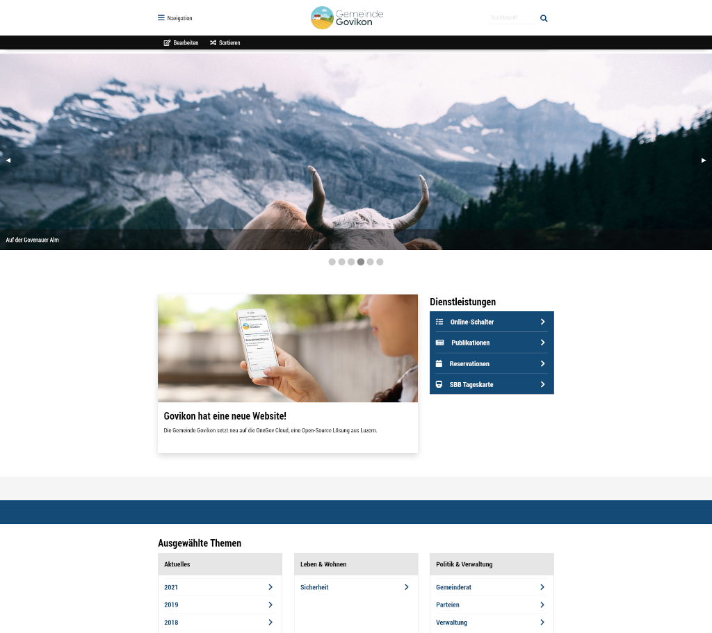

OneGov Cloud
============

Technical Documentation
-----------------------

OneGov Cloud is a Swiss initiative to provide municipalities with open-source
web-applications.

You reached the technical documentation of this initiative intended for
administrators, developers and other technical personnel.

To learn more about the product, please refer
to `https://www.admin.digital <https://www.admin.digital>`_.

Introduction
------------

OneGov Cloud is a RAD framework built with `Morepath, the web micro-framework
with superpowers <https://morepath.readthedocs.io/en/latest/>`_. It enables us
to write web applications for government agencies in a secure, efficient,
and modern manner.

OneGov Cloud has strong opinions about the technology it employs. This has the
following consequences:

 * It only runs on POSIX platforms.
 * It uses PostgreSQL 10+ and won't support other databases.
 * It requires Python 3.11+.
 * It aims to provide concurrency through multiple processes and is not
   necessarily thread-safe.

Internationalization
^^^^^^^^^^^^^^^^^^^^

OneGov Cloud supports many languages and locales. That means that number- date-
and other formatting can use the appropriate locale. All static text is
translatable.

Content is translatable too, though OneGov Cloud doesn’t offer any tools for it
at this moment. This is generally a UI problem, not a framework problem.

URL paths are not translatable and should use English.

Development and documentation is in English. It’s what we are most comfortable
with when it comes to software development.

Try it!
^^^^^^^

Have a look at OneGov Town, our flagship application:

- `<https://govikon.onegovcloud.ch>`_.

Start your own OneGov Town instance for free:

- `<https://start.onegovcloud.ch>`_.

Documentation Highlights
^^^^^^^^^^^^^^^^^^^^^^^^

Design
++++++

An introduction into the history and the design of OneGov Cloud.

.. toctree::
    :maxdepth: 2

    design

Org
+++

An introduction to the most fully-featured application of OneGov Cloud.

.. toctree::
    :maxdepth: 2

    org

Feriennet
+++++++++

An introduction to the most popular application of OneGov Cloud.

.. toctree::
    :maxdepth: 2

    feriennet

Formcode
++++++++

Describes our very own Formcode™ Syntax, a DSL to write forms with.

.. toctree::
    :maxdepth: 2

    formcode

Public API
++++++++++

Find out how to use the public API.

.. toctree::
    :maxdepth: 1

    api/agency/README.md

.. toctree::
    :maxdepth: 1

    api/election_day/README.md

Source
^^^^^^

OneGov Cloud is open source, available on GitHub:
`<https://github.com/onegov/onegov-cloud>`_.

Further Reading
^^^^^^^^^^^^^^^

Find out more about the inner workings of OneGov Cloud by having a look at
the OneGov Cloud modules documentation.

.. toctree::
    :maxdepth: 2

    modules
