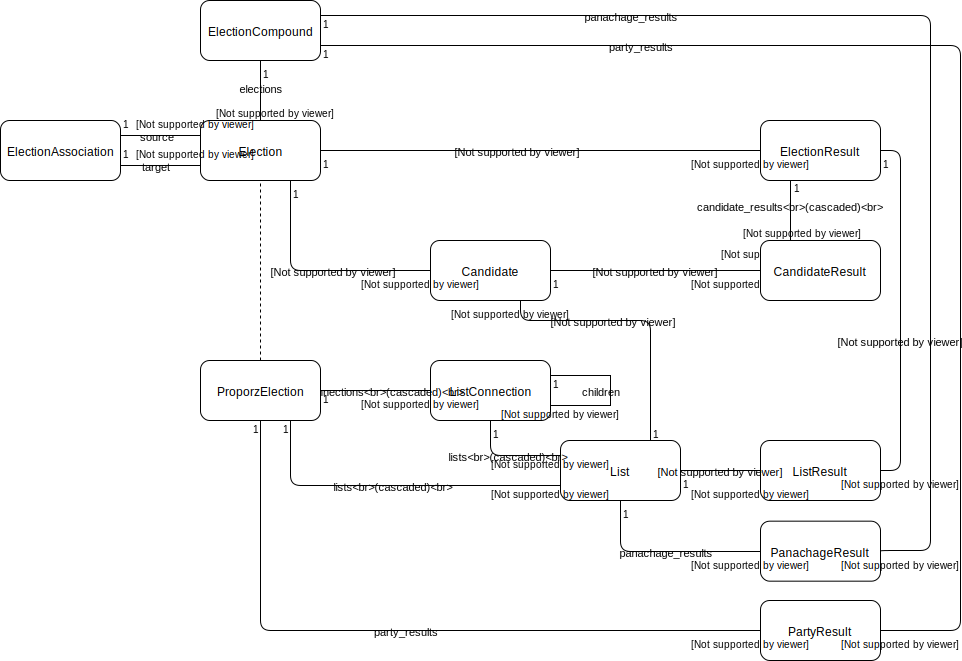
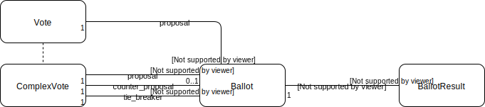

## onegov.ballot

## Domain of Influcence

The domain of influence is used in elections and votes (cantonal elections, communal votes, ...) and on an election_day instance (cantonal instance, communal instance).

| eCH-0155       | onegov.ballot DomainOfInfluenceMixin | onegov.election_day Principal | Identifier             |
| -------------- | ------------------------------------ | ----------------------------- | ---------------------- |
| CH: Bund       | federation                           |                               |                        |
| CT: Kanton     | canton                               | canton                        | shortcut (be, zh, ...) |
| BZ: Bezirk     | region                               |                               |                        |
| MU: Gemeinde   | municipality                         | municipality                  | BFS                    |
| SK: Stadtkreis | -                                    |                               | district_id            |

## Models

### Elections

### Votes

